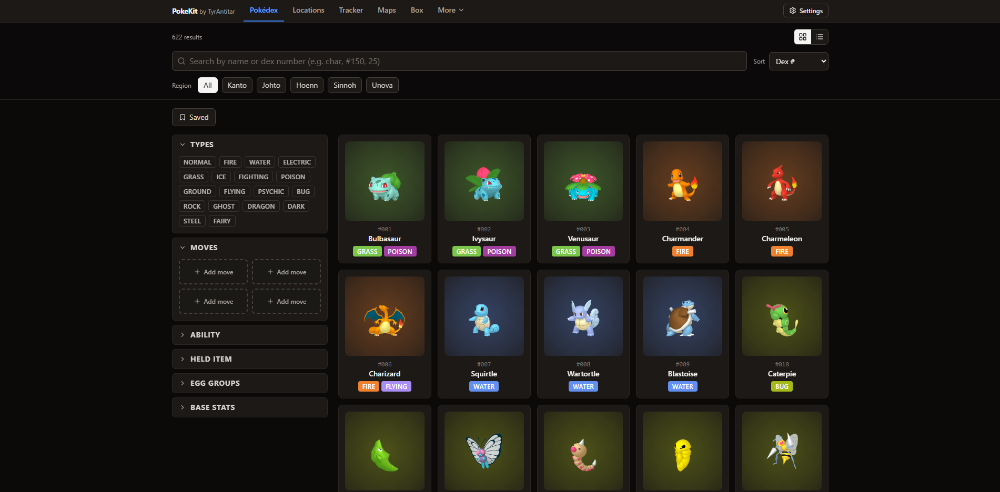
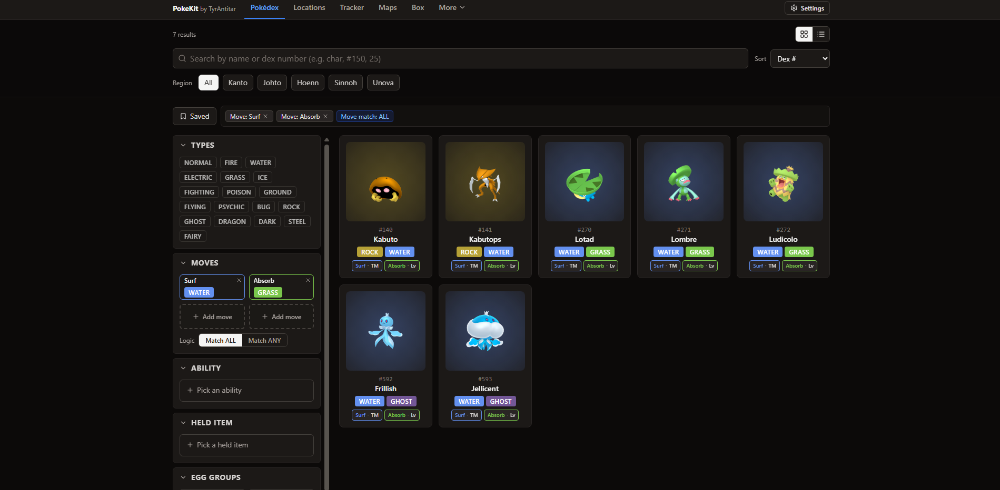
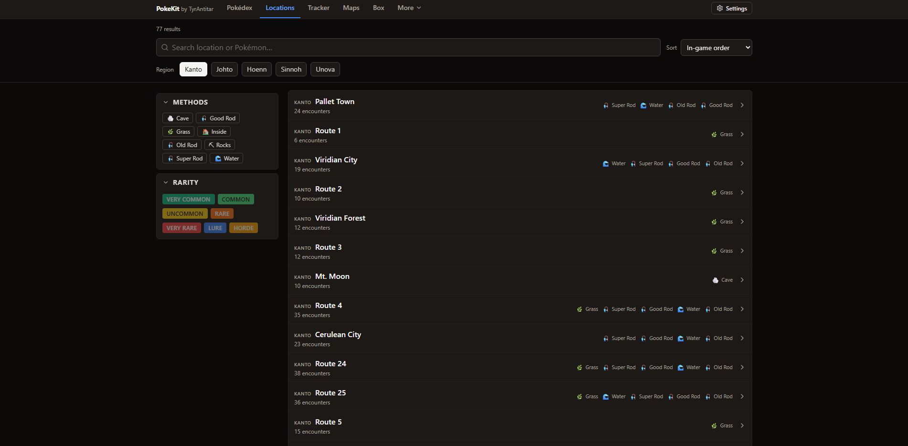
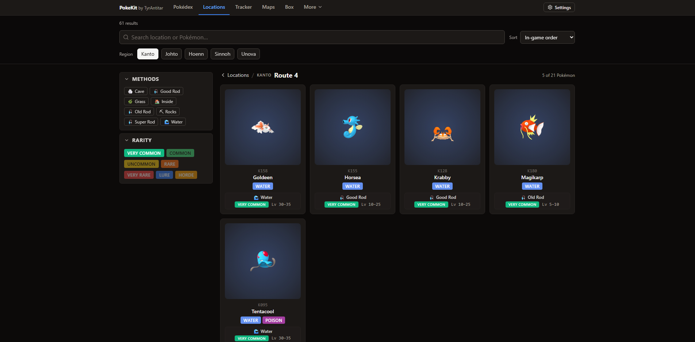
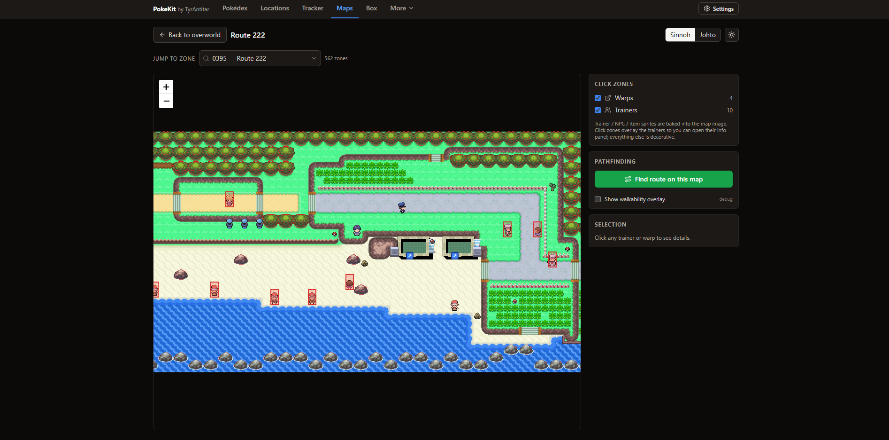
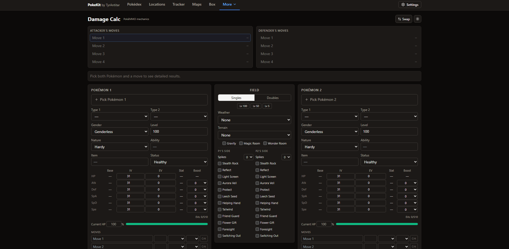
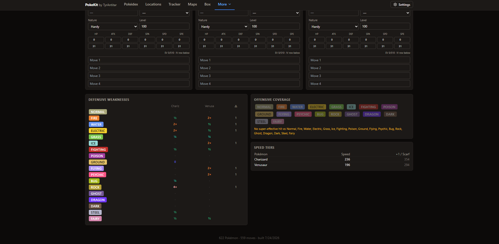
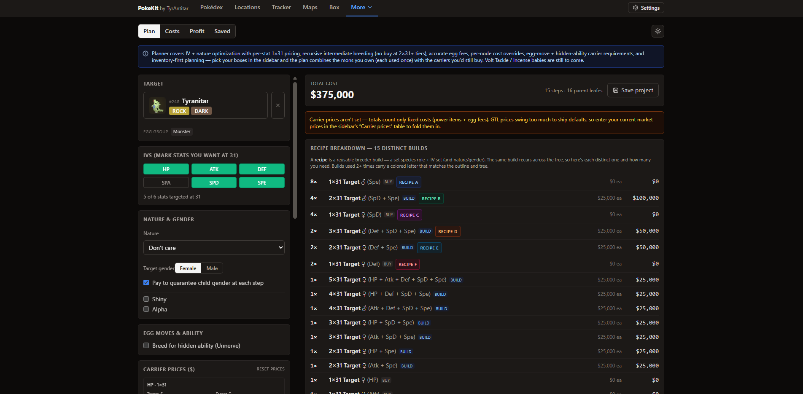
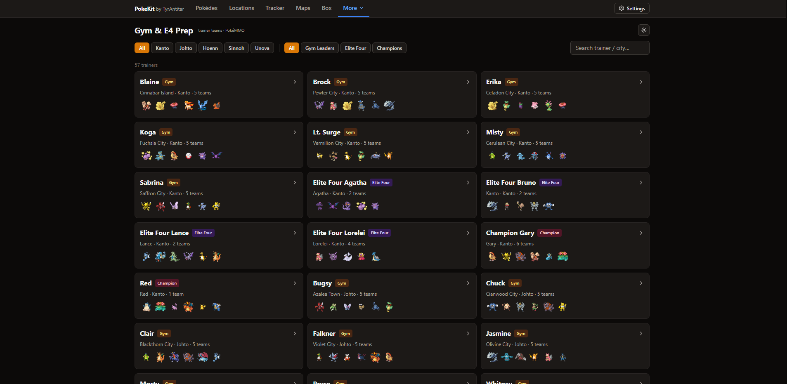

# PokeKit

**A curated, app-ready toolkit for the [PokéMMO](https://pokemmo.com/) fan community** — Pokédex, encounter finder, interactive maps, damage & catch calculators, a team builder, a breeding planner, and more, all served from a single fast web app (with an optional Windows desktop build that adds OCR capture).

[](https://antproj.github.io/PokeKit/)
[](https://react.dev/)
[](https://vitejs.dev/)
[](https://tailwindcss.com/)
[](https://tauri.app/)
[](#license)

> **[▶ Open the live app](https://antproj.github.io/PokeKit/)**

<p align="center">
  <a href="https://antproj.github.io/PokeKit/"></a>
</p>

---

## What it is

PokeKit started as a Pokédex and grew into a small **toolkit** for PokéMMO players. It ships a single curated dataset — **622 Pokémon, 559 moves, 170 abilities, and 2,956 items across all five regions** — merged from multiple community sources by a reproducible build pipeline, then fetched at runtime by a code-split React single-page app. A thin [Tauri](https://tauri.app/) desktop shell reuses the exact same web build and layers on Windows screen-capture + OCR.

Everything runs client-side and deploys as static files to GitHub Pages — there is no backend.

## The toolkit

| Tab | What it does |
| --- | --- |
| **Pokédex** | The home tab: browse every Pokémon, or search and filter by type, moves, ability, held item, egg group, and base-stat ranges. Side-by-side compare (up to 6), quick actions (add to Box/Team, mark caught), shareable filter URLs + saved presets, and a rich detail popup with an embedded **catch calculator**. |
| **Locations** | A Pokédex-style encounter finder: pick a region, filter by encounter **method × rarity** as a true combo (e.g. *Grass + Horde*), and drill into any location to see exactly which Pokémon appear there, with level ranges, rarity, and time of day. |
| **Tracker** | Per-Pokémon catch tracking and a planning view, persisted locally with JSON import/merge. |
| **Maps** | Interactive [Leaflet](https://leafletjs.com/) region maps with per-zone detail, cross-zone pathfinding/walkability, and trainer-NPC markers. Map tiles are hosted on Cloudflare R2. |
| **Box** | A persistent, PokéMMO-style collection of owned Pokémon with filtering and JSON import/export. On desktop, it can **OCR a summary screenshot** to add a mon (with gender / shiny / alpha detection). |
| **Damage Calc** | A full-parity PokéMMO damage calculator built on a **vendored & patched [`@smogon/calc`](https://github.com/smogon/damage-calc) fork**: bidirectional results, rolls, KO chance, editable EVs/IVs/natures/abilities/items, and a complete field panel (weather, terrain, hazards, singles/doubles). |
| **Team Builder** | Up to six sets per team with defensive-weakness, offensive-coverage, and speed-tier analyses. Showdown / PokéPaste import & export, round-trip verified. |
| **Gym & E4 Prep** | Browse gym leaders, Elite Four, and champions per region; see what's super-effective against their team, what they threaten you with, and counters pulled from your Box. |
| **Breeding** | An IV/nature breeding **optimizer**: target spread → breeding-step tree, recipe & cost breakdown, egg moves, and hidden-ability tracking — inventory-aware, so it factors in the Pokémon you already own. |

## Screenshots

<table>
  <tr>
    <td width="50%"><br><sub><b>Pokédex</b> — filter by type, move, ability, held item, egg group, and stat ranges; cards show <i>how</i> each move is learned.</sub></td>
    <td width="50%"><br><sub><b>Locations</b> — every route by region, filterable by encounter method × rarity.</sub></td>
  </tr>
  <tr>
    <td><br><sub><b>Locations</b> — a route's Pokémon with method, level range, and rarity.</sub></td>
    <td><br><sub><b>Maps</b> — interactive Leaflet zones with trainer markers and pathfinding.</sub></td>
  </tr>
  <tr>
    <td><br><sub><b>Damage Calc</b> — full-parity PokéMMO engine with a complete field panel.</sub></td>
    <td><br><sub><b>Team Builder</b> — defensive weakness, offensive coverage, and speed-tier analysis.</sub></td>
  </tr>
  <tr>
    <td><br><sub><b>Breeding</b> — IV/nature optimizer with a full recipe &amp; cost breakdown.</sub></td>
    <td><br><sub><b>Gym &amp; E4 Prep</b> — leader / Elite Four / champion teams by region.</sub></td>
  </tr>
</table>

## Engineering highlights

The parts that were interesting to build:

- **Multi-source data pipeline.** [`scripts/build-data.mjs`](scripts/build-data.mjs) merges PokéMMO Hub game state (authoritative for stats, learnsets, evolutions, and encounters) with PokeAPI-derived English text into one ~6.7 MB dataset. It's fetched **once at runtime**, never bundled, keeping the app shell small.
- **Exact-mechanics damage engine.** A vendored fork of `@smogon/calc` ([`vendor/pokemmo-calc`](vendor/pokemmo-calc)) is patched for PokéMMO's specific mechanics and wired in as CommonJS through Vite's interop, giving the calculator true in-game parity rather than a mainline-Pokémon approximation.
- **Windows desktop capture.** The [Tauri v2](https://tauri.app/) shell ([`src-tauri/`](src-tauri)) points its WebView at the live site, then adds `Windows.Graphics.Capture` / `PrintWindow` capture and `Windows.Media.OCR` in Rust. All capture features are gated on `window.__TAURI__`, so **the identical build is a plain website in a browser and a capture tool on the desktop**.
- **Inventory-aware breeding solver.** The planner computes a from-scratch buy-optimal tree, then does iterative *pin-and-resolve* — pinning the most valuable owned Pokémon as a free override and re-solving — so a plan never reuses one owned mon twice and always shows the savings from your boxes.
- **Deliberately dependency-light architecture.** No state-management library (state is lifted into `App.jsx` by design), no TypeScript, `HashRouter` for GitHub Pages, and `React.lazy` code-splitting for the heavy pages (maps, breeding, damage engine).
- **Windows-safe deploy.** A custom [`deploy-gh-pages.mjs`](scripts/deploy-gh-pages.mjs) uses a git worktree + a single `git rm -rf .` to publish thousands of map assets without hitting Windows' command-line length cap that the off-the-shelf `gh-pages` package trips over.

## Tech stack

- **React 18** + **react-router-dom v7** (`HashRouter`)
- **Vite 5** build/dev server, **Tailwind CSS 3**, **lucide-react** icons
- **Leaflet** / react-leaflet for interactive maps
- **Tauri v2** (Rust + WebView2) for the Windows desktop shell
- Vendored **`@smogon/calc`** fork for the damage engine
- **Cloudflare R2** for map tile/image hosting; **AWS SDK (S3)** + **sharp** in the map-build tooling
- Pure ESM. No test framework, no lint, no TypeScript — intentionally lean.

## Architecture

The repo is three things glued together:

1. **A data pipeline** (`scripts/*.mjs`) that merges raw community sources into generated JSON under `public/data/`.
2. **A React SPA** (`src/`) that fetches that JSON at runtime for browse / search / filter / calc.
3. **A Tauri desktop shell** (`src-tauri/`) that loads the live site and adds screen capture + OCR.

```
raw community data ──▶ scripts/build-data.mjs ──▶ public/data/pokemmo.json ──┐
(PokéMMO Hub, wiki,          build-trainers.mjs ──▶ trainers.json, …          │
 gym sheet, PokeAPI)         build-map-data.mjs ──▶ maps/<region>/ (+ R2)     │
                                                                              ▼
                                                     React SPA  ◀── fetch ──  static assets
                                                        │
                                                        ├──▶ GitHub Pages (web)
                                                        └──▶ Tauri WebView (desktop + OCR)
```

## Getting started

Requires **Node ≥ 20.6**.

```bash
npm install
npm run build:data       # generate public/data/pokemmo.json  (required once before first run)
npm run build:trainers   # generate trainers.json + gym-cities.json for Gym & E4 Prep
npm run dev              # Vite dev server → http://localhost:5173/PokeKit/
```

`build:data` is required at least once: `App.jsx` fetches the generated `pokemmo.json`, which is gitignored. Re-run it whenever anything under `data/raw/` changes.

### Common scripts

| Command | Purpose |
| --- | --- |
| `npm run dev` | Start the Vite dev server (auto-reloads). |
| `npm run build` | Production build to `dist/`. |
| `npm run preview` | Serve the production build locally. |
| `npm run build:data` | Rebuild the core `pokemmo.json` dataset from `data/raw/*`. |
| `npm run build:trainers` | Rebuild the trainer / gym-city data. |
| `npm run deploy` | Build everything and publish to the `gh-pages` branch. |
| `npm run desktop:dev` / `desktop:build` | Run / build the Windows desktop app (see [DESKTOP.md](DESKTOP.md)). |

> Interactive map data (`build:map-data`, `upload:maps`) is gated behind a local `POKEMMO_MAPS_DIR` and Cloudflare R2 credentials, so it's optional and only relevant if you're regenerating maps.

## Desktop app (Windows)

The desktop build is a thin [Tauri v2](https://tauri.app/) shell whose window points at the **live site**, so a web deploy updates the desktop app too — no rebuild needed for non-capture changes. It adds screen capture + Windows OCR and a global hotkey. Setup (Rust toolchain + WebView2) is documented in **[DESKTOP.md](DESKTOP.md)**.

```bash
npm run desktop:dev      # dev build with the Tauri window
npm run desktop:build    # release build
```

## Deployment

The site is published to GitHub Pages from the `gh-pages` branch:

```bash
npm run deploy           # build:data + build:trainers + vite build + prune, then publish
```

After ~a minute it's live at **https://antproj.github.io/PokeKit/**. The Vite `base` is `/PokeKit/` (case-sensitive — GitHub Pages paths are), and the deploy uses a custom Windows-safe worktree-based publish script.

## Repository layout

```
pokemmo-tools/
├── data/raw/        Raw JSON inputs to the pipeline (see data/raw/README.md for sources)
├── scripts/         Build & deploy pipeline (build-data, build-trainers, maps, deploy)
├── src/
│   ├── pages/       One file per tab (Pokédex, Locations, Maps, Damage Calc, …)
│   ├── components/  Presentational UI (cards, pickers, modals, badges)
│   └── lib/         Pure logic (formatting, type math, damage, breeding optimizer, …)
├── vendor/          Vendored @smogon/calc fork (PokéMMO mechanics)
├── src-tauri/       Windows desktop shell (Rust: capture + OCR)
└── public/data/     Generated datasets, fetched at runtime (gitignored / R2-hosted)
```

## Data sources & credits

PokeKit is a curation layer — it does not own the underlying game data. Sources include the PokéMMO Hub (current game state), [pokemmo.fandom.com](https://pokemmo.fandom.com/) (CC-BY-SA, trainer teams), a community Gym Leader Team Query Form, and PokeAPI-derived English descriptions. The damage engine is a fork of Smogon's [`@smogon/calc`](https://github.com/smogon/damage-calc) — see [`vendor/pokemmo-calc/NOTICE.md`](vendor/pokemmo-calc/NOTICE.md). See [`data/raw/README.md`](data/raw/README.md) for the full source list and update instructions.

## Disclaimer

This is an **unofficial, fan-made** tool and is **not affiliated with or endorsed by PokéMMO, Nintendo, Game Freak, or The Pokémon Company**. Pokémon and all related names are trademarks of their respective owners. Game data belongs to its respective sources, credited above.

## License

The application source code is released under the **MIT License**. Bundled game data and the vendored damage engine remain under their own respective licenses.
